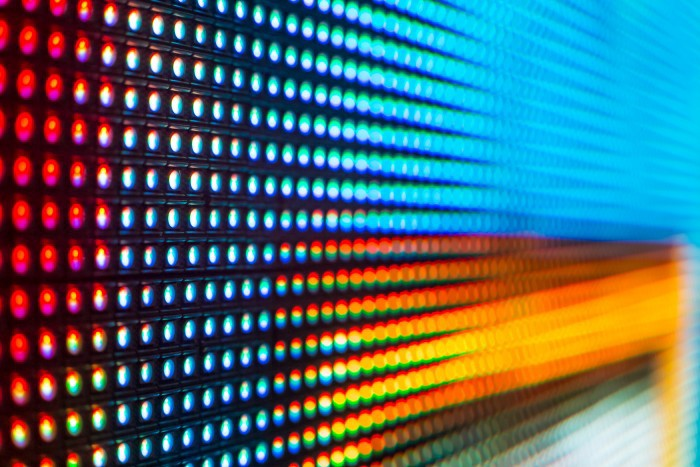

# LED

[LED Video Walls](http://pixelflexled.com/led-university/) are another common option for displaying digital art on a large scale (also called [LED Displays](https://en.wikipedia.org/wiki/LED\_display) — not to be confused with LED Monitors where the light source is simply the LED backlight). These are usually comprised of individual tiles that are linked together and driven by a special display driver box that addresses the tiles from a standard monitor input. The tiles are generally either single all-in-one RGB LED’s or larger individual R,G and B LED’s that are placed close together. The primary spec of an LED wall is its pixel pitch, measured in millimeters. If you are viewing a wall close up, you want a low pixel pitch — some of the lowest available are around 1.6mm. Larger pixel pitch like 16mm to 20mm is perfectly acceptable if your viewer is really far away from the screen because their eye won’t be able to discern individual pixels as easily. LED walls are also one of the only display types that can be viewable in direct sunlight. Some of them are 3000nits or more of brightness, which explains why they are the display of choice in places like Times Square.

They have a wide variety of models and applications. Some are used as jumbotrons in stadiums, as high end storefront signage, or are used as sculptural stage elements. Some move towards the spectrum of lighting elements and are extremely high pixel pitch. These large pixel pitch tiles can be used almost as “transparent” elements because when the audience is far away, they are able to see through the frame — as in this [video wall](https://vimeo.com/143733724). Stage lighting examples are the [LightSlice](https://lmg.net/technology/lightslice/), [Vanish](https://lmg.net/technology/vanish-25-mm/), and the [Saber](http://www.upstaging.com/saber/). Some manufacturers also provide custom LED tile work and can do more unusual shapes like spheres or triangles.

The primary drawback of LED walls is cost, although the prices have been dropping rapidly in the past few years as these become more commonplace. Finding price points for certain elements isn’t usually publicly available but it can cost around $2000 for an individual tile and the driver box can be $5000–10,000. Most LED walls are typically rentals due to the large cost of purchasing them. They do last a long time in the case of purchasing, but even a modest sized wall at a high resolution can run into the hundreds of thousands of dollars very quickly. The cost of installation (for rental or permanent) can also be an additional hurdle since you typically need an experienced technician to set them up and get the pixel mapping established. They also have a particular aesthetic that is suited to viewing from far away. Up close they can be uncomfortably bright, and their pixels can be a distraction. Some stage designers will overlay a black or dark grey rear projection material or even acrylic overtop of the LED’s to soften them and provide a more diffuse look.
