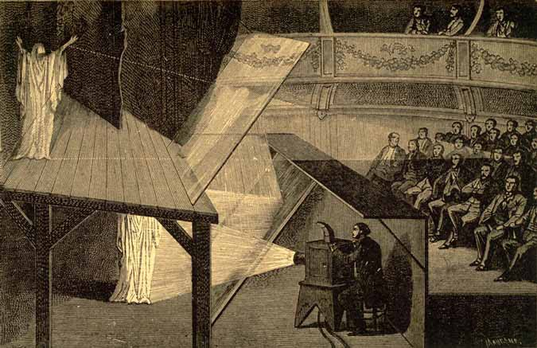

# Pepper's Ghost

[Pepper’s Ghost](https://en.wikipedia.org/wiki/Pepper's\_ghost) is a classic illusion — it has been around for over a century and is still making headlines. 99% of the time, when you see a headline with the word “hologram” it is talking about Pepper’s ghost.

Historically, the effect comes out of [Phantasmagoria](https://en.wikipedia.org/wiki/Phantasmagoria), a fascinating tradition of theater illusions that were developed in the 18th and 19th centuries that frightened audiences with never before seen images of spirits and floating otherworldly beings. The [Magic Lantern](http://www.magiclantern.org.uk/history/history01.php) is another one of these early theater effects and it is one of the earliest forms of the projector. The name Pepper’s Ghost comes from John Henry Pepper who popularized the effect in the mid-1800’s with his friend Henry Dircks (who arguably developed it before Pepper). However, the illusion was first [described](http://www.mindserpent.com/American\_History/books/Porta/jportac17.html#bk17VIII) in the 1600’s by an Italian scholar named Giambattista della Porta in his book Natural Magic:

> Wherefore to describe the matter, let there be a chamber wherein no other light comes, unless by the door or window where the spectator looks in. Let the whole window or part of it be of glass, as we use to do to keep out the cold. But let one part be polished, that there may be a looking glass on both sides, whence the spectator must look in. For the rest do nothing. Let pictures be set over against this window, marble statues, and suchlike. For what is without will seem to be within, and what is behind the spectators back, he will think to be in the middle of the house, as far from the glass inward, as they stand from it outwardly, and so clearly and certainly, that he will think he sees nothing but truth. But lest the skill should be known, let the part be made so where the ornament is, that the spectator may not see it, as above his head, that a pavement may come between above his head. And if an ingenious man do this, it is impossible that he should suppose that he is deceived.

Pepper’s ghost is very easy to implement. The simplest version involves a transparent reflecting surface (a sheet of glass, plastic, or a [half silvered mirror](http://en.wikipedia.org/wiki/Beam\_splitter)), and an image source (a monitor, projection screen, or a lit source). There are two versions of this effect that are commonly used — the classic one from the 19th century typically involves two separate physical spaces and specialized lighting. The modern version of Pepper’s ghost involves a digital screen (monitor, or projected image) and a half silvered mirror or specialized film designed to be invisible to the viewer. This version is also used for teleprompters where the camera lens is positioned behind the mirror facing the speaker. Both are essentially the same in principal.

Glass mirrors are the most accessible way to achieve this effect (it can even be done with reflective plastic and a smart phone), but at a certain point it becomes difficult to scale the glass to be large enough. For stage productions, there is specialized plastic film that can be employed to reflect much larger surfaces. [Musion](http://musion.com) is the primary company that comes up while searching, and another is [Arena 3D](http://www.arena3d.com). It is worth noting that Musion claims a [patent](https://worldwide.espacenet.com/publicationDetails/biblio?CC=US\&NR=5865519\&KC=\&FT=E\&locale=en\_EP) on a version of this 100+ year old technology and has hit “imitations” with [lawsuits](http://www.hollywoodreporter.com/thr-esq/hologram-lawsuit-alki-david-michael-jackson-690899) in the [past](http://www.digitalsignagenews.eu/index.php?option=com\_content\&view=article\&id=488:musion-an-open-response-to-arena-3d\&catid=41:industry-news\&Itemid=71). It is also easy to source your own film from 3M or other sources in Asia — another version of the film is manufactured by [DuPont](http://www.proavbiz-europe.com/index.php?option=com\_content\&view=article\&id=6184:the-battle-of-new-orleans-musion-vs-arena-3d\&catid=86:feature\&Itemid=401984).

Image of reflective foil setup for stage production — [Source](http://www.glimmdisplay.com)

Carefully controlled lighting is essential for this effect to look its best. The source of the image must be bright in comparison to the surroundings behind the transparent surface. The observer should also be in a very dark space so their own reflection doesn’t show up in the mirror. It is also helpful to have something slightly visible behind the transparent surface so that your floating image has something to float overtop of and give the viewer the parallax depth cue. The effect can be striking if combined with props behind the mirror — like a person sitting on a chair or animations that swirl around an object. However, there are limitations to this depth effect.

Peppers ghost is still very much a 2D effect and does not present an image in three dimensions. It is just a mirror reflecting another flat plane. Parallax between the reflected image and the background is what gives our eyes the illusion of the content floating in mid air. A false sense of 3D can be achieved depending on your source and how the reflecting surfaces are arranged. There are some implementations of the effect that put 4 mirrors in a pyramid shape under a monitor (some have marketed themselves as holograms — [sparking](https://medium.com/@sableraph/is-the-holus-3d-hologram-the-biggest-scam-in-the-history-of-kickstarter-6e86dd5bde7d#.laqsjfr5f) [controversy](http://joanielemercier.com/kickstarter\_is\_broken/)). By having the monitor display a different image for each mirror, the observer gets more of a 3D view as they walk around — even if it is just 4 discrete viewing angles. Head or eye tracking would have to be employed to make the effect a little more convincing, but then it would only work for one observer at a time. As it usually functions, the effect may look best from one vantage point, especially if you are trying to align it with an object behind the surface. This misalignment can be minimized by having your observer be further back so when they move their head, the parallax isn’t as great as if they are right in front of the screen.

Other reference links:

* [https://hackaday.com/2022/05/03/blending-peppers-ghost-synths-and-vintage-tvs/](https://hackaday.com/2022/05/03/blending-peppers-ghost-synths-and-vintage-tvs/)
